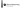

---
<p align="center">


</p>

libcontemporary is a set of common classes used in the* apps.

---

# Build
```bash
cmake
cmake --build
```


# Install
```bash
cmake --install
```

---

> © Victor Tran, 2023. This project is licensed under the GNU General Public License, version 3, or at your option, any later version.
> 
> Check the [LICENSE](LICENSE) file for more information.
